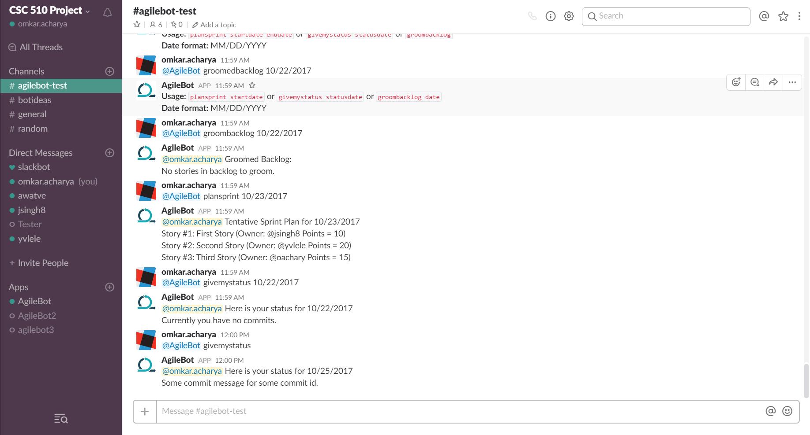

# Bot Milestone

## 1. Use Cases
Feedback from the [Initial Design Proposal](../../999fa26cb55d864fafe9adfea8fa3bc60f84bf38/Design/Design.md) was:
* Refocus [Use Case 3](../../999fa26cb55d864fafe9adfea8fa3bc60f84bf38/Design/Design.md#use-case-3-backlog-grooming).
* Text-only output would get very long, consider more concise output + action buttons.

The [Updated Design Proposal](../Design/Design.md) includes the above modifications.
* **Refocus [Use Case 3](../Design/Design.md#use-case-3-backlog-grooming):** The team lead will request for a *sprint plan* and provide a list of team members and stories. The bot will provide possible story assignments and team lead confirms. Bot creates sprint plan and posts link.

* **Text-only output would get very long, consider more concise output + action buttons:** After the feedback from the initial design proposal, we have concised the output and have planned to add the action buttons for each use case. For more information, please check the [desgin sketches wireframe](../Design/Design.md#4-design-sketches)

## 2. Mocking
<!-- Authority pattern -->
Our choice of programming language for the bot implementation is `Python 3.5`. We have used built-in `unittests.mock` and `nose` for mocking at the unit tests level. We have used a combination of Authority and Factory pattern to mock the responses when a running bot instance is serving the users.

- As a first step, we identified the format of the responses received from the third-party entities in our project which are:
    - Rally (AgileCentral) as our Agile platform.
    - GitHub as our Source Control platform.
- Then we recorded some of them in different files and used them to return 'mocked' response messages.
- When AgileBot is interacting with these services in 'mocking' mode, the mocking mechanism intercepts requests to these platforms and responds with an appropriate recorded response.
- We have used Factory pattens to generate either a mock or a real object that interacts with these platforms.
- Since we have different layers e.g. application, data and service, when we interact with actual platform, no code changes are required except a configuration switch change in `<application-root>/environment_variables.txt` that says `MOCK=True`.

## 3. Bot Implementation
### Bot Platform:
We have used `SlackClient` in `Python` to create a slack bot called `AgileBot`. We have created a slack channel [#agilebot-test](https://csc510project.slack.com/messages/agilebot-test/) and have added `AgileBot` to the channel. Now, whenever a user wants to use the bot, she has to call the bot using `@AgileBot` followed by a proper command. Also, direct messages to the bot is also allowed using the same bot tag.

**Note:** AgileBot code has dependencies on the list of python libraies as mentioned below   
- slackclient
- request
- nose
- selenium
- pyral

To install these dependecies, just run `python setup.py`.

### Bot Integration:
We have a fully operational `Slack bot` that responds to the commands `plansprint`, `givemystatus`, and `groombacklog`, each corresponding to a test case. If the user enters an invalid command or argument, the bot replies with the `Usage` containing the following commands:

**Commands:**
  * `groombacklog`: Using this command, the `Scrum Master` is able to assign points to the stories in the backlog.
  * `plansprint`: Using this command, stories are assigned to the team members. User provides the end date of the sprint to be planned along with the command. If the date is not provided, then the bot takes the current date as the default date.
  * `givemystatus`: Using this command, a team member is able to provide his/her status. The status is based on user's `GitHub` commits for/between the given dates. The current date is taken if no date parameter is passed.

  
  Here is how the channel looks like:  
    
  
  

## 4. Selenium testing of each use case
Currently, we have implemented 6 selenium tests, 2 per each use case describing a `happy` and `alternate` paths respectively.

### Overview for each test:
* Selenium Test runs the bot application on a daemon thread so a separate invocation is not required.
* Selenium also setups the required mock environment so that they can be executed independently.
* Selenium logs in as 'Tester' user in the slack project.
* It invokes each use case twice (happy and alternate)
* Currently, the happy and alternate paths are distinguished by a mock decision on the date. Odd day value in the date invokes the happy path and an even date invokes the alternate path.
* The test first asserts that a successful message has been sent to the slack channel. Then it checks the following messages for AgileBot's response for up to 5 seconds (customizable). This makes sure that a stale response doesn't pass the test and only a new response is valid. The test fails if it doesn't get a response in time or the response doesn't match the expected response. All of these are executed by xpath queries.

## 5. Task Tracking
All iterations and the associated tasks are included in this [Worksheet](WORKSHEET.md)

## 6. Screencast
The screencast for this milestone can be found [here](https://youtu.be/hhpNxg8dAYc)
