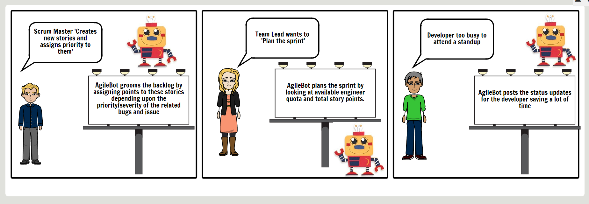

# Design Milestone

## 1. Problem Statement

### What is the problem?
Agile is the most widely used methodology in software development. Standups, grooming, backlog, scrum practices form the core essence of Agile. There are various tools that help in tracking/managing these processes but not automate them.

### Why is it a problem?
A huge chunk of time is spent every day in menial agile processes. For instance, tasks like Sprint planning, triaging a bug, assigning a user story to an engineer are the tasks that can be automated to a major extent.

## 2. Bot Description
<!--What does your bot do? -->
AgileBot is a [SlackBot](https://get.slack.help/hc/en-us/articles/202026038) that interfaces with Project planning tool [Rally](https://rally1.rallydev.com). When called for its services, AgileBot looks up for unassigned bugs and user stories, estimates their time frame and assigns the user stories to the 'best' engineer after taking into consideration various heuristics.

<!--Why is a bot a good solution for the problem? -->
AgileBot's mission is to automate these repetitive tasks to a degree that will help engineers stay in flow by reducing distractions, eliminating context switches and thus increasing productivity.

<!-- Does your bot have a conversation with users (e.g. hubot), or does it just response to events (e.g., coveralls bot on GitHub)? -->

* @AgileBot can be added to the team's Slack Room.
* For backlog grooming, the Scrum master can mention @AgileBot with text `GroomBacklog` to automatically assign points to the backlog stories.
* For sprint planning, a Team Leader can invoke AgileBot by mentioning it to `PlanSprint`.
* Engineers working as a part of the sprint can submit their everyday statuses by mentioning AgileBot with the text `GiveMyStatus`.
* Scrum Master/Team Leader can view the entire team's status by calling `GetTeamStatus`.

<!-- Does your bot fit in one of the categories we talked about in class? A code drone vs documentation bot? -->
> AgileBot fits into the **Space Reactor** category.

<!--
2.1 Input?
2.2 Workflow
2.3 Output/suggestions
-->

## 3. Use Cases

### Use case 1: Story Assignment

**1. Preconditions**  
* Agile platform with APIs available for automation.
* Stories with points assigned.
* Engineers/Users with available quotas.
* Teams with user information and roles.
  
**2. Main Flow**
    The team lead will request for a *sprint plan* and provide a list of team members and stories `[S1]`. The bot will provide possible story assignments `[S2]` and team lead confirms `[S3]`. Bot creates sprint plan `[S4]` and posts link `[S5]`.

**3. Subflows**

    [S1] Provide the list of team members, their quota, and stories.
    [S2] Displays story assignments confirmation message with action button.
    [S3] Accepts the assignment by clicking action button.
    [S3] Create a sprint plan.
    [S4] Post the link that contains details for team members to look at.
    
**4. Alternative Flows**

    [E1] Team members are unavailable.
    [E2] Stories are unavailable.

### Use case 2: Status Updating

**1. Preconditions**
* Engineers must have commits with the description in the system.
* Bot should have read access to user commits.
* Teams with user information and roles.  

**2. Main Flow**
   The user will request for a *status update* and provide the standup/team id/date `[S1]`. The bot will provide possible status updates based on commit logs `[S2]`. The user updated and/or confirms `[S2]`. Bot posts user's status update to standup/team channel `[S3]`.
      
      
**3. Subflows**

    [S1] Provide list of dates.
    [S2] Verify the git commits returned by AgileBot.
    [S3] Update the interactive message if needed.
    [S3] Post the link.
    
**4. Alternative Flows**

    [E1] Team members are unavailable.
    [E2] Commits are unavailable.
    [E3] Commit description is unavailable.

### Use case 3: Backlog Grooming

**1. Preconditions**
* Agile platform with APIs available for automation.
* Pending stories with unassigned points. 
* Related bugs with priorities.
* Engineers with available quotas.
* Teams with user information and roles.

**2. Main Flow**
    The scrum master will request for *backlog grooming* `[S1]`. The bot will provide possible *point allocation* to stories `[S2]` and scrum master confirms `[S3]`. Bot assigns the points `[S4]` and posts the link `[S5]`.

**3. Subflows**

    [S1] Provide list of team members, stories, and bugs.
    [S2] Interactive message with posssible point allocation.
    [S3] Interactive message with action buttons to confirm or deny.
    [S4] Assign the points considering related bug priority and severity.
    [S5] Agile Platform Link to view the newly groomed stories.

**4. Alternative Flows**

    [E1] Team members are unavailable.
    [E2] Stories are unavailable.
    [E3] Stories are available but points already assigned.
    

## 4. Design Sketches
<!-- -->

### Wireframe
<!-- Create a wireframe mockup of your bot in action. -->
#### Wireframe 1: Team Lead initiated sprint planning using AgileBot

#### Wireframe 2: An engineer reporting his daily status using AgileBot

#### Wireframe 3: Scrum Master grooming the backlog using AgileBot

### Storyboard
<!-- Create a storyboard that illustrates the primary task that a user undergoes with bot. -->

## 5. Architecture Design + Additional Patterns

<!-- This section should be several diagrams + paragraphs of text. This is the opportunity to really think through how you might build your system. Consider all the criteria listed here in your description. Generic architectures that do not properly reflect a solution will receive low scores. -->

    
### Architectural Diagram
<!-- Create a diagram that illustrates the components of your bot, the platform it is embedded in, third-party services it may use, data storage it may require, etc. -->

A high level architecture of AgileBot looks like this:  

<!--- Description:    
-->

<!--
* Components
    * Event Listener (Slack)
    * Bot Reactor Engine
    * REST Interactor
        * GitHub
        * Rally
-->
### Architecture components
<!-- Describe the architecture components in text. -->

AgileBot will interact with *three* third party components:
* Rally
* GitHub
* Slack

For communication with these third party services, AgileBot needs to have the knowledge of authentication tokens generated for each system.

**AgileBot** has *four* major components:

* Rally Manager
* GitHub Manager
* Slack Event Handler
* Bot Reactor Engine

The handlers and managers would be registered with the Bot Reactor Engine during startup. When a user sends a text message in a Slack channel that has AgileBot as a member, AgileBot would take actions based on that text. Respective event handler would be invoked and depending on the context, AgileBot would act and talk to the components like Rally, Git or Slack over REST interface.

### Per Component Description

* **[Rally](https://rally1.rallydev.com)** is a free open source project management platform for agile developers & designers and project managers who want a beautiful tool that makes work truly enjoyable. As part of this project, Agilebot will require the following functionalities from Rally.
    * Manage User stories 
        * Create/Modify/Delete Story.
        * List of Stories in total or per user.
    * Points
        * Create/Modify/Delete Point. 
        * List of Points in total or per user.
    * Tasks
        * Create/Modify/Delete task.
        * List of Tasks in total or per user. 
    
    To achieve this functionality, *Rally Manager* will send the REST request to the Rally. For instance: There is an un-assigned bug/story. AgileBot will get the task stats for each user, plus some extra information from Rally. It can then find the work load of each user and accordingly assign the story to the user.

* **[Git](https://git-scm.com/)** is a version control system for tracking changes in computer files and **[GitHub](https://github.com/)** is a hosting service for Git repositories to coordinate work on those files among multiple people. AgileBot would request GitHub for data like check-in comments, review comments, CD/CI stats if available using REST APIs. This data will be used to provide the status updates of a feature or team member to Team leader or Scrum master.

* **[Slack](https://slack.com/)** is a cloud-based set of team collaboration tools and services widely used in especially software industry. AgileBot leverages ubiquity and popularity of Slack APIs to act as a trigger for automating the Agile processes.

* **Bot Reactor Engine** is the core logic component that:
    1. Decides story points based on the severity/priority of the bugs/features related to it.
    2. Assigns stories to users based on their previous story completion stats and level of expertise.
    3. Submits statuses by looking at the user's git commits.
    4. Plans sprints by matching story points with available user quota. 

<!--
List of REST API's required by the event handler.

*  User Stories

|         URL                        | Method |   Functionality    |
| -----------------------------------|--------| ------------------ |
| /api/v1/userstories                |  GET   | List user stories  |
| /api/v1/userstories                |  POST  | Create user story  |
| /api/v1/userstories/{userStoryId}  |  GET   | Get user story     |
| /api/v1/userstories/{userStoryId}  |  PUT   | Modify user story  |
-->

### Constraints/Guidelines
<!-- Describe any constraints or guidelines that should be established in building software for your architecture (e.g., a bot cannot send data from one user to another user). -->
* Only a Team Leader can call `PlanSprint`.
* Only a Scrum Master can call `GroomBacklog`.
* Only a Team Lead or a Scrum Master can call`GetTeamStatus`.
* Anyone can call `SubmitMyStatus`.

### Additional Design Patterns
<!-- Describe any additional design patterns that may be relevant for your bot design. -->

We believe that AgileBot's design closely resembles **Explicit Event Systems** pattern in which users like Scrum Master, Team Leader, or Engineer (user) explicitly generate events e.g. `GiveMyStatus` acting as a *Publishers* whereas AgileBot acts as a *Subscriber* of these events and *reacts* by taking appropriate actions guided by the core logic engine.
